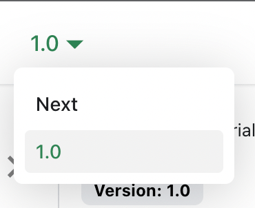

# Управление версиями документации

Docusaurus поддерживает несколько версий документации.

## Создание версии документации

Выпусти версию проекта 1.0:

```bash
npm run docusaurus docs:version 1.0
```

Каталог `docs` будет скопирован в `versioned_docs/version-1.0`, а также будет создан файл `versions.json`.

Теперь у документации две версии:

- `1.0` по адресу `http://localhost:3000/docs/` — документация версии 1.0;
- `current` по адресу `http://localhost:3000/docs/next/` — **будущая, ещё не выпущенная документация**.

## Добавление списка версий

Чтобы удобно переходить между версиями, добавь раскрывающийся список версий.

Измени файл `docusaurus.config.js`:

```js title="docusaurus.config.js"
export default {
  themeConfig: {
    navbar: {
      items: [
        // highlight-start
        {
          type: 'docsVersionDropdown',
        },
        // highlight-end
      ],
    },
  },
};
```

В панели навигации появится раскрывающийся список версий документации:



## Обновление существующей версии

Версионированную документацию можно редактировать в соответствующем каталоге:

- `versioned_docs/version-1.0/hello.md` обновляет `http://localhost:3000/docs/hello`;
- `docs/hello.md` обновляет `http://localhost:3000/docs/next/hello`.
